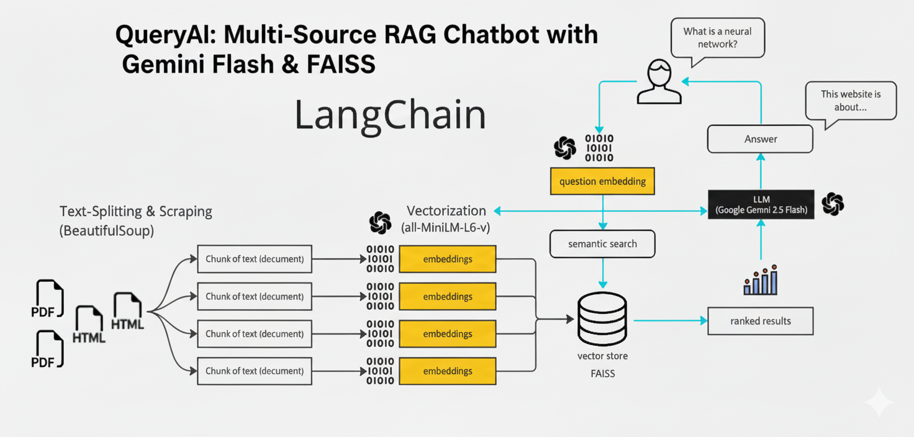

# QueryAI - AI Powered Multi-Source Knowledge Assistant

QueryAI is a cutting-edge AI application that allows users to interactively query and gain insights from multiple data sources, including PDFs and websites. By leveraging advanced embeddings and retrieval-augmented generation (RAG), QueryAI provides accurate, context-aware responses to user queries in real-time.

---

## 🚀 Features

- **Multi-Source Knowledge Integration:** Combine PDFs and web content into a unified knowledge base for seamless querying.
- **Real-Time Conversational AI:** Ask questions and receive contextually relevant answers using Google Gemini LLM.
- **Vector Database Powered:** Efficient storage and retrieval of information using FAISS vector store with HuggingFace embeddings.
- **Chunking & Retrieval:** Automatically splits large documents into manageable chunks for better retrieval and context management.

---

## 🛠️ Technology Stack

- **Backend & AI:** Python, LangChain, FAISS, HuggingFace Embeddings, GoogleGenerativeAI
- **Document Processing:** PyPDF2 for PDFs, WebBaseLoader for URLs
- **Web App:** Streamlit for interactive user interface
- **Environment Management:** dotenv for environment variables

---

## 💡 How It Works

1. **Source Input:** Users provide one or more PDFs or URLs via the Streamlit sidebar.  
2. **Processing & Chunking:** PDFs and web content are processed into text chunks for embeddings.  
3. **Vector Store Creation:** Chunks are converted into embeddings and stored in a FAISS vector store for efficient retrieval.  
4. **Query & Response:** Users ask questions in natural language. The RAG pipeline retrieves relevant context and generates an AI response.

---

### 🏗️ Architecture Diagram



---

## ⚡ Key Highlights

1. **Multi-Source Knowledge Retrieval:** Process and query multiple documents and websites simultaneously for enriched responses.
2. **Real-Time Interaction:** Instantaneous conversational experience with context-aware responses, enabling rapid decision-making.
3. **Persistent Vector Store:** FAISS vector store allows scalable and efficient retrieval across large datasets.

---

## 📂 Usage

1. Clone the repository:  
```bash
git clone https://github.com/jayeshgit65/QueryAI-AI-Powered-Multi-Source-Knowledge-Assistant
cd QueryAI-AI-Powered-Multi-Source-Knowledge-Assistant
````

2. Install dependencies:

```bash
pip install -r requirements.txt
```

3. Create a `.env` file and configure your API keys (if any).

4. Run the Streamlit app:

```bash
streamlit run app.py
```

5. Add PDF or URL sources in the sidebar, process them, and start querying!

---

## 📈 Impact

* Enables **data-driven insights** from heterogeneous sources in one platform.
* Improves productivity by providing **accurate, contextual answers** in real-time.
* Suitable for **researchers, analysts, and enterprises** to query internal and external knowledge sources efficiently.

---

## 🔗 License

This project is licensed under the MIT License.

